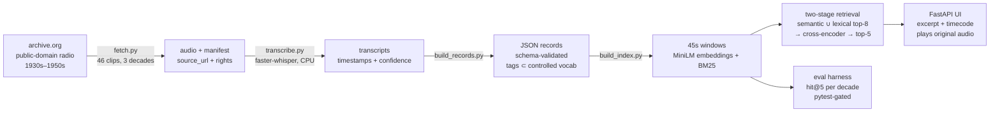

# dormant-audio-search

Surfacing stories in dormant audio: a weekend-scale prototype that makes a small
archive of public-domain historical radio broadcasts (1930s–1950s) searchable by
natural-language query — every result linked back to the original recording at
the exact timecode.

Built as a scaled-down proof of a longer archive-indexing plan: **index a small
slice, prove the quality, write down the rules, then show how to scale.**

## The 90-second tour

1. `python -m uvicorn das.app:app` → open http://127.0.0.1:8000
2. Ask: *"news about the invasion of Normandy"*
3. Ranked segments come back with the transcript excerpt, program, date,
   timecode, ASR confidence, and AI-generated topic tags.
4. Click **▶ Play** — the original 1944 broadcast starts at that exact moment.
5. Open [/eval](http://127.0.0.1:8000/eval) — retrieval quality, scored with
   hit@5 against a golden query set and broken down per decade.

## Architecture

Everything runs locally. No RAG framework — retrieval is ~150 hand-written
lines (BM25 included), because a pipeline you wrote is a pipeline you can
explain, debug, and evaluate.

| Stage | Command |
|---|---|
| fetch 46 clips from archive.org | `python -m das.fetch` |
| transcribe (faster-whisper base, CPU int8) | `python -m das.transcribe` |
| build schema-validated records + tags | `python -m das.build_records` |
| build the search index | `python -m das.build_index` |
| search from the CLI | `python -m das.retrieval "workers on strike"` |
| serve the UI | `python -m uvicorn das.app:app` |
| hermetic tests (CI) | `python -m pytest tests/ -q` |
| retrieval eval (local, needs index) | `python -m pytest eval/ -q` |

## Ethics by design

- **Public domain only.** All audio comes from archive.org's historical radio
  collections; **no NPR audio is used anywhere**. Where items carry no explicit
  rights statement, the `rights` field says *presumed* public domain and why —
  recording the uncertainty instead of laundering it.
- **The source stays attached.** Every record and every search result carries
  `source_url` back to archive.org, and every result plays the *original*
  recording — an excerpt never replaces it.
- **Provenance is explicit.** Transcripts and tags are marked `ai_generated`
  in the schema (it's `const: true` — a record claiming human-verified tags
  fails validation, because nothing here has been human-verified yet).
- **Tags can't drift.** Topic tags are constrained to a 20-term controlled
  vocabulary; the JSON schema rejects anything outside it. Free-form AI
  tagging fragments a catalog ("election" / "elections" / "voting"); a
  vocabulary the model must map into doesn't.
- **Honest uncertainty.** ASR confidence is shown per result. 1930s shellac
  recordings transcribe worse than 1950s tape — the per-decade eval breakdown
  makes that visible instead of hiding it in an average.
- **AI suggests, a human decides.** The tool ranks candidates and shows its
  work; it never asserts an answer without a source. If nothing matches,
  it says so.

## Evaluation

A golden set of natural-language queries → expected clips, scored with hit@5
(did any expected clip land in the top 5?). The suite **fails if overall hit@5
drops below its floor**, so retrieval quality is gated by tests, not by how the
demo felt. Scores are reported **per decade** — on a real archive that same
breakdown (per program, per community) is the bias evaluation.

## Known limitations

- **ASR quality on old audio.** Whisper-base on 80-year-old broadcasts makes
  real errors ("wholesalers" → "whole sailors"). Names and accents break first.
  No word-error-rate measurement yet — that needs hand-checked reference
  transcripts, which is exactly what I'd sample first on a real corpus.
- **No speaker diarization.** Segments say *when*, not *who*. pyannote is the
  natural next step.
- **English-centric.** One French clip in the corpus transcribes poorly and is
  labeled by language, but the pipeline doesn't handle multilingual archives.
- **Tagging is zero-shot.** Embedding similarity against term descriptions,
  threshold hand-picked, unaudited. Real vocabulary mapping needs a labeled
  sample and per-term precision numbers.
- **46 clips.** Small enough to check by hand — which is the point — but
  ranking behavior at 850,000 records is a different engineering problem
  (ANN indexes, sharding, caching).

## What I'd do with a real archive

A real broadcast archive isn't a blank slate — decades of librarianship
already produced transcripts, metadata, and an in-house subject vocabulary.
This pipeline would invert accordingly:

- **Build on existing transcripts and metadata first**; run ASR only where
  transcripts are missing, and hand-check samples with a logged word error
  rate before trusting any of it.
- **Map AI tags INTO the institution's own controlled vocabulary** (and public
  media standards like PBCore) rather than inventing a parallel one — same
  schema-validation trick, bigger term list, with librarians owning the list.
- **Build the golden set with the journalists and archivists** who search the
  archive daily, and break scores down per program and per community, not just
  per decade.
- **Keep every AI field additive and versioned** — nothing a model produces
  ever overwrites the human record.

## License / rights

Code: MIT. Audio is not committed to this repo; it is fetched at build time
from archive.org, and each clip's manifest entry records its source URL and
rights statement.
